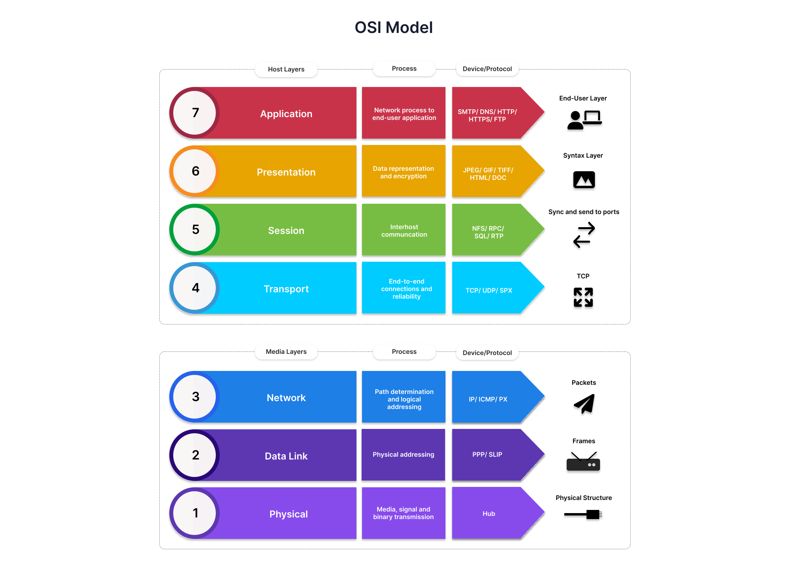
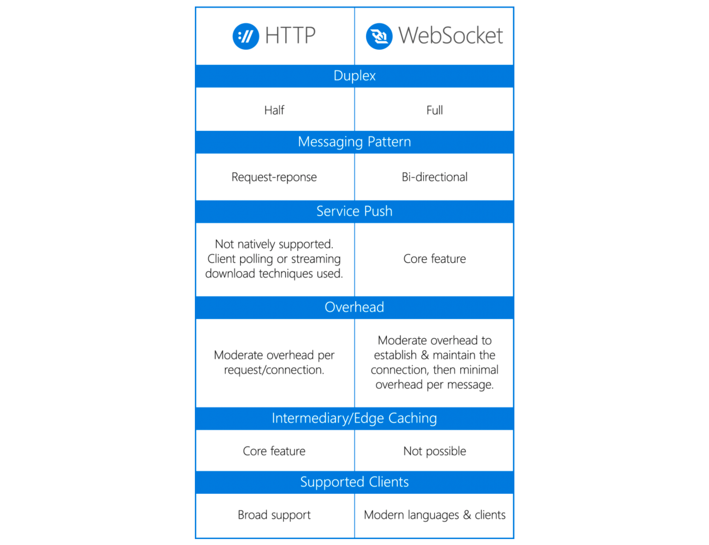
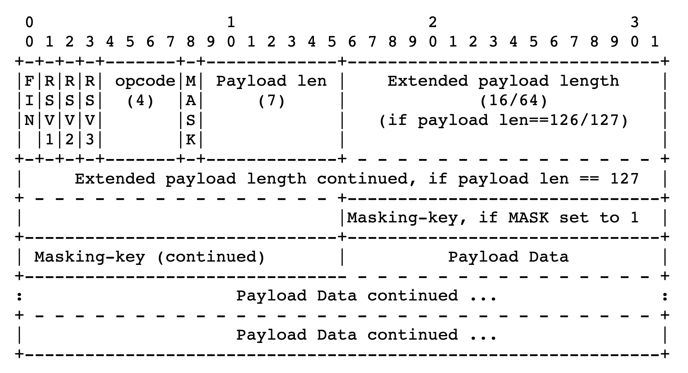

layout: true

.signature[@algogrit]

---

class: center, middle

# Websockets Training

Gaurav Agarwal

---

# Agenda

- *WebSockets* are magic!

---

class: center, middle


Software Engineer & Product Developer

Director of Engineering & Founder @ https://codermana.com

ex-Tarka Labs, ex-BrowserStack, ex-ThoughtWorks

---

class: center, middle

*What we wanted*


---

class: center, middle

*What we got*


---

## As an instructor

- I promise to

  - make this class as interactive as possible

  - use as many resources as available to keep you engaged

  - ensure everyone's questions are addressed

---

## What I need from you

- Be vocal

  - Let me know if there any audio/video issues ASAP

  - Feel free to interrupt me and ask me questions

- Be punctual

- Give feedback

- Work on the exercises

- Be *on mute* unless you are speaking

---
class: center, middle

## Class progression


---
class: center, middle

### 📚 Content ` > ` 🕒 Time

---
class: center, middle

## Show of hands

*Yay's - in Chat*

---
class: center, middle

## Why Websockets?

---
class: center, middle

### OSI Model Recap

---
class: center, middle



---
class: center, middle


---
class: center, middle

#### TCP vs UDP, ...

---
class: center, middle

#### ... & HTTP

---
class: center, middle

### Taking a closer look at `TCP` / `HTTP 1.*`

---
class: center, middle

TCP slow start

---
class: center, middle


---

When transmission of data from sender to receiver begins in a network, there may be unknown conditions as to what the network can handle. Slow start helps to mitigate the pitfalls of this unknown by implementing the following functionality.

- A sender begins transmissions to a receiver by slowly probing the network with a packet that contains its initial congestion window (cwnd).

- The client receives the packet and replies with its maximum buffer size, also known as the receiver's advertised window (rwnd).

- If the sender receives an acknowledgement from the client, it then doubles the amount of packets to send to the client.
Step 3 is repeated until the sender no longer receives acknowledgment from the receiver which means either congestion is detected, or the client's window limit has been reached.

.content-credits[https://www.keycdn.com/support/tcp-slow-start]

---
class: center, middle

### Problem with using a new HTTP req/resp for each BiDi message?

---

- The server is forced to use a number of different underlying TCP connections for each client: one for sending information to the client and a new one for each incoming message.

- The wire protocol has a high overhead, with each client-to-server message having an HTTP header.

- The client-side script is forced to maintain a mapping from the outgoing connections to the incoming connection to track replies.

---
class: center, middle

### Solution?

---
class: center, middle

2 way communication using *WebSocket*

---
class: center, middle



.image-credits[https://blogs.windows.com/windowsdeveloper/2016/03/14/when-to-use-a-http-call-instead-of-a-websocket-or-http-2-0/]

---
class: center, middle

### Alternatives?

---

- Polling

- Long Polling

- Server Side Events (SSE)

---
class: center, middle


.image-credits[https://codeburst.io/polling-vs-sse-vs-websocket-how-to-choose-the-right-one-1859e4e13bd9]

---
class: center, middle

## Websocket vs

---
class: center, middle

### ReST

---

#### *Re*presentational *S*tate *T*ransfer

- defined in 2000 by Roy Fielding in his doctoral dissertation

- it is designed for Internet-scale usage, so the coupling between the user agent (client) and the origin server must be as lightweight (loose) as possible

- Maps HTTP 1.1 methods onto CRUD actions

---

#### Architectural properties

- performance in component interactions, which can be the dominant factor in user-perceived performance and network efficiency

- scalability allowing the support of large numbers of components and interactions among components

- simplicity of a uniform interface

- modifiability of components to meet changing needs (even while the application is running)

- visibility of communication between components by service agents

- portability of components by moving program code with the data

- reliability in the resistance to failure at the system level in the presence of failures within components, connectors, or data

---
class: center, middle

Stateful vs *Stateless*

---
class: center, middle

### HTTP 2

---
class: center, middle

The biggest difference is that, unlike websockets, HTTP/2 defines its own multiplexing semantics: how streams get identifiers and how frames carry the id of the stream they're on. HTTP/2 also defines flow control semantics for prioritizing streams. This is important in most real-world applications of BiDi.

.content-credits[https://stackoverflow.com/questions/28582935/does-http-2-make-websockets-obsolete]

---
class: center, middle

## When **NOT** to use WebSockets

---

You might be using WebSockets incorrectly if:

- The connection is used only for a very small number of events, or a very small amount of time, and the client does not need to quickly react to the events.

- Your feature requires multiple WebSockets to be open to the same service at once.

- Your feature opens a WebSocket, sends messages, then closes it—then repeats the process later.

- You’re re-implementing a request/response pattern within the messaging layer.

- The resulting design is cost-prohibitive.

  - Ask yourself: Is a HTTP solution substantially less effort to design, implement, test, and operate?

.content-credits[https://blogs.windows.com/windowsdeveloper/2016/03/14/when-to-use-a-http-call-instead-of-a-websocket-or-http-2-0/]

---
class: center, middle

## Enter the *Drogon*

---
class: center, middle

*Drogon* is a C++14/17-based HTTP application framework.

.content-credits[https://drogon.docsforge.com/]

---
class: center, middle

*Drogon* can be used to easily build various types of web application server programs using C++.

---
class: center, middle

cross-platform framework

---
class: center, middle

supports Linux, macOS, FreeBSD, OpenBSD, HaikuOS, and Windows

---

- Use a non-blocking I/O network lib based on *epoll* (*kqueue* under macOS/FreeBSD) to provide high-concurrency, high-performance network IO

- Support Http1.0/1.1 (server side and client side)

- Support cookies and built-in sessions

- Support back-end rendering, the controller generates the data to the view to generate the Html page. Views are described by CSP template files

- Provide a convenient and flexible routing solution from the path to the controller handler

---

- Support filter chains to facilitate the execution of unified logic

- Support https (based on OpenSSL)

- Support **WebSocket** (server side and client side)

- Support JSON format request and response, very friendly to the Restful API application development

- Support C++ coroutines

---
class: center, middle

and [more](https://drogon.docsforge.com/#overview)...

---
class: center, middle

### [Setting up `Drogon`](https://github.com/AgarwalConsulting/websockets-training/blob/master/Setup.md)

.content-credits[https://drogon.docsforge.com/master/installation/]

---
class: center, middle

### Rapid Application Development with `drogon_ctl`

---
class: center, middle

*Demo*: Building a simple server with Drogon

---
class: center, middle

#### Creating a new project

```bash
drogon_ctl create project <project-name>
```

---
class: center, middle

Understanding the project structure & `main.cc`

---
class: center, middle

#### Adding a simple `index.html`

```bash
echo '<h1>Hello Drogon!</h1>' >> index.html
```

---
class: center, middle

#### Building and running the application

```bash
cd build
cmake ..
make

./<binary>
```

---

### Type of Controllers

- Simple Controller

- HTTP Controller

- Websocket Controller

---
class: center, middle

*Demo*: Building a simple "Hello, World!" API

---
class: center, middle

#### Creating a Simple HTTP Controller

```bash
drogon_ctl create controller <YourController>
```

---
class: center, middle

#### How about a ReSTful API?

---
class: center, middle

*Code Walkthrough*: An [employee management server](https://github.com/AgarwalConsulting/websockets-training/blob/master/notes/emp_server.md)

---
class: center, middle

## C++ 14/17/20 Refresher (Optional)

---

- RAII

- std::move

- Smart Pointers

- Functional Programming

  - Lambdas

  - Closures

- Concurrency using Coroutines

---
class: center, middle

## Understanding WebSockets - A close look at [RFC 6455](https://datatracker.ietf.org/doc/html/rfc6455)

.content-credits[https://datatracker.ietf.org/doc/html/rfc6455]

---
class: center, middle

*The WebSocket Protocol enables two-way communication between a client running untrusted code in a controlled environment to a remote host that has opted-in to communications from that code.*

---
class: center, middle

### WebSocket Lifecycle

---
class: center, middle

*The protocol consists of an opening handshake followed by basic message framing, layered over TCP.*

---
class: center, middle

#### Opening Handshake

---

The handshake from the client looks as follows:

```
  GET /chat HTTP/1.1
  Host: server.example.com
  Upgrade: websocket
  Connection: Upgrade
  Sec-WebSocket-Key: dGhlIHNhbXBsZSBub25jZQ==
  Origin: http://example.com
  Sec-WebSocket-Protocol: chat, superchat
  Sec-WebSocket-Version: 13
```

The handshake from the server looks as follows:

```
  HTTP/1.1 101 Switching Protocols
  Upgrade: websocket
  Connection: Upgrade
  Sec-WebSocket-Accept: s3pPLMBiTxaQ9kYGzzhZRbK+xOo=
  Sec-WebSocket-Protocol: chat
```

---
class: center, middle

*The opening handshake is intended to be compatible with HTTP-based server-side software and intermediaries, so that a single port can be used by both HTTP clients talking to that server and WebSocket clients talking to that server.*

---
class: center, middle

*Any status code other than 101 indicates that the WebSocket handshake has not completed and that the semantics of HTTP still apply.*

---

Typical options:

- the subprotocol selector (|`Sec-WebSocket-Protocol`|)

  - used to indicate what subprotocols (application-level protocols layered over the WebSocket Protocol) are acceptable to the client

- list of extensions support by the client (|`Sec-WebSocket-Extensions`|),

- The |`Origin`| header field [RFC6454](https://datatracker.ietf.org/doc/html/rfc6454) is used to protect against unauthorized cross-origin use of a WebSocket server by scripts using the WebSocket API in a web browser.

- the |`Sec-WebSocket-Version`| header field, provides a way for a client to indicate the version of the WebSocket Protocol that it prefers

---

The |`Sec-WebSocket-Key`| header field in the client handshake:

```
  Sec-WebSocket-Key: dGhlIHNhbXBsZSBub25jZQ==
```

& the `Sec-WebSocket-Accept` header field in the server handshake:

```
  Sec-WebSocket-Accept: s3pPLMBiTxaQ9kYGzzhZRbK+xOo=
```

prevents an attacker from tricking a WebSocket server by sending it carefully crafted packets using `XMLHttpRequest` or a form submission.

---
class: center, middle

the server has to take the value (as present in the header field, e.g., the [base64-encoded](https://datatracker.ietf.org/doc/html/rfc4648) version minus any leading and trailing whitespace) and concatenate this with the Globally Unique Identifier [(GUID)](https://datatracker.ietf.org/doc/html/rfc4122) "258EAFA5-E914-47DA-95CA-C5AB0DC85B11" in string form, which is unlikely to be used by network endpoints that do not understand the WebSocket Protocol.

A SHA-1 hash (160 bits), base64-encoded, of this concatenation is then returned in the server's handshake.

---
class: center, middle

*Once the client and server have both sent their handshakes, and if the handshake was successful, then the data transfer part starts.*

---
class: center, middle

#### Closing Handshake

---
class: center, middle

*The closing handshake is far simpler than the opening handshake.*

---
class: center, middle

*Either peer can send a control frame with data containing a specified control sequence to begin the closing handshake.*

---
class: center, middle

*After sending a control frame indicating the connection should be closed, a peer does not send any further data; after receiving a control frame indicating the connection should be closed, a peer discards any further data received.*

---
class: center, middle

*By sending a Close frame and waiting for a Close frame in response, certain cases are avoided where data may be unnecessarily lost.*

---
class: center, middle

### Sending & receiving "messages"

---
class: center, middle

*After a successful opening handshake, clients and servers transfer data back and forth in conceptual units referred to in this specification as "messages".*

---
class: center, middle

*data is transmitted using a sequence of frames.*

---
class: center, middle

### Base Framing Protocol



.image-credits[https://datatracker.ietf.org/doc/html/rfc6455#section-5.2]

---
class: center, middle

```
  0                   1                   2                   3
  0 1 2 3 4 5 6 7 8 9 0 1 2 3 4 5 6 7 8 9 0 1 2 3 4 5 6 7 8 9 0 1
  +-+-+-+-+-------+-+-------------+-------------------------------+
  |F|R|R|R| opcode|M| Payload len |    Extended payload length    |
  |I|S|S|S|  (4)  |A|     (7)     |             (16/64)           |
  |N|V|V|V|       |S|             |   (if payload len==126/127)   |
  | |1|2|3|       |K|             |                               |
  +-+-+-+-+-------+-+-------------+ - - - - - - - - - - - - - - - +
  |     Extended payload length continued, if payload len == 127  |
  + - - - - - - - - - - - - - - - +-------------------------------+
  |                               |Masking-key, if MASK set to 1  |
  +-------------------------------+-------------------------------+
  | Masking-key (continued)       |          Payload Data         |
  +-------------------------------- - - - - - - - - - - - - - - - +
  :                     Payload Data continued ...                :
  + - - - - - - - - - - - - - - - - - - - - - - - - - - - - - - - +
  |                     Payload Data continued ...                |
  +---------------------------------------------------------------+
```

---

- FIN:  1 bit

  - Indicates that this is the final fragment in a message.  The first fragment MAY also be the final fragment.

- RSV1, RSV2, RSV3:  1 bit each

  - MUST be 0 unless an extension is negotiated that defines meanings for non-zero values.  If a nonzero value is received and none of the negotiated extensions defines the meaning of such a nonzero value, the receiving endpoint MUST *Fail the WebSocket Connection*.

- Mask:  1 bit

  - Defines whether the "Payload data" is masked.  If set to 1, a masking key is present in masking-key, and this is used to unmask the "Payload data" as per Section 5.3.  All frames sent from client to server have this bit set to 1.

- Payload length:  7 bits, 7+16 bits, or 7+64 bits

  - The length of the "Payload data", in bytes: if 0-125, that is the payload length.  If 126, the following 2 bytes interpreted as a 16-bit unsigned integer are the payload length.  If 127, the following 8 bytes interpreted as a 64-bit unsigned integer (the most significant bit MUST be 0) are the payload length.

---

- Masking-key:  0 or 4 bytes

  - All frames sent from the client to the server are masked by a 32-bit value that is contained within the frame.  This field is present if the mask bit is set to 1 and is absent if the mask bit is set to 0.

- Payload data:  (x+y) bytes

  - The "Payload data" is defined as "Extension data" concatenated with "Application data"

- Extension data:  x bytes

  - The "Extension data" is 0 bytes unless an extension has been negotiated.  Any extension MUST specify the length of the "Extension data", or how that length may be calculated, and how the extension use MUST be negotiated during the opening handshake. If present, the "Extension data" is included in the total payload length.

- Application data:  y bytes

  - Arbitrary "Application data", taking up the remainder of the frame after any "Extension data".  The length of the "Application data" is equal to the payload length minus the length of the "Extension data".

---

- Opcode:  4 bits

  - Defines the interpretation of the "Payload data". If an unknown opcode is received, the receiving endpoint MUST *Fail the WebSocket Connection*.

    - `%x0` denotes a continuation frame

    - `%x1` denotes a text frame

    - `%x2` denotes a binary frame

    - `%x3-7` are reserved for further non-control frames

    - `%x8` denotes a connection close

    - `%x9` denotes a ping

    - `%xA` denotes a pong

    - `%xB-F` are reserved for further control frames

---
class: center, middle

#### Control Frames

---

##### Close Frame

- contains an opcode of `0x8`

- The application MUST NOT send any more data frames after sending a Close frame.

- If an endpoint receives a Close frame and did not previously send a Close frame, the endpoint MUST send a Close frame in response.

- After both sending and receiving a Close message, an endpoint considers the WebSocket connection closed and MUST close the underlying TCP connection.

---

##### Ping

- contains an opcode of `0x9`

- Upon receipt of a Ping frame, an endpoint MUST send a Pong frame in response, unless it already received a Close frame.

##### Pong

- contains an opcode of `0xA`

- A Pong frame sent in response to a Ping frame must have identical "Application data" as found in the message body of the Ping frame being replied to.

---
class: center, middle

*A Ping frame may serve either as a keepalive or as a means to verify that the remote endpoint is still responsive.*

---
class: center, middle

#### Data Frames

---
class: center, middle

*Data frames (e.g., non-control frames) are identified by opcodes where the most significant bit of the opcode is `0`.*

---

- Currently defined opcodes for data frames include 0x1 (Text), 0x2 (Binary).

- Opcodes `0x3`-`0x7` are reserved for further non-control frames yet to be defined.

---
class: center, middle

### Closing the connection

---
class: center, middle

To *Close the WebSocket Connection*, an endpoint closes the underlying TCP connection.

---
class: center, middle

An endpoint SHOULD use a method that cleanly closes the TCP connection, as well as the TLS session, if applicable, discarding any trailing bytes that may have been received.

---
class: center, middle

### WebSocket URIs

---
class: center, middle

```
ws-URI = "ws:" "//" host [ ":" port ] path [ "?" query ]
wss-URI = "wss:" "//" host [ ":" port ] path [ "?" query ]
```

---
class: center, middle

## back to coding...

---
class: center, middle

```bash
drogon_ctl create controller -w <YourWSCtrl>
```

---
class: center, middle

### Drogon's `WebSocketController`

.content-credits[https://drogon.docsforge.com/master/controller-introduction/controller-websocketcontroller/]

---

- handleNewConnection

- handleNewMessage

- handleConnectionClosed

---
class: center, middle

#### Connecting using simple browser JavaScript code

.content-credits[https://github.com/AgarwalConsulting/websockets-training/blob/master/examples/browser_js/connect.js]

---
class: center, middle

*Exercise*: Notify connected clients about a newly created employee

.content-credits[https://github.com/AgarwalConsulting/websockets-training/blob/master/challenges/notfiy-new-employees.md]

---
class: center, middle

## Filters

.content-credits[https://drogon.docsforge.com/master/filter/]

---
class: center, middle

*Demo*: Adding authentication to our ws server

---
class: center, middle

## Enabling `wss` over `ws`

---
class: center, middle

*Demo*: Configuring SSL using Drogon

.content-credits[https://drogon.docsforge.com/master/configuration-file/#configuration-file-details]

---
class: center, middle

## Scalability of WebSockets

.content-credits[https://stackoverflow.com/questions/47268038/websockets-and-scalability]

---
class: center, middle

Code
https://github.com/AgarwalConsulting/websockets-training

Slides
https://websockets-training.slides.agarwalconsulting.io
