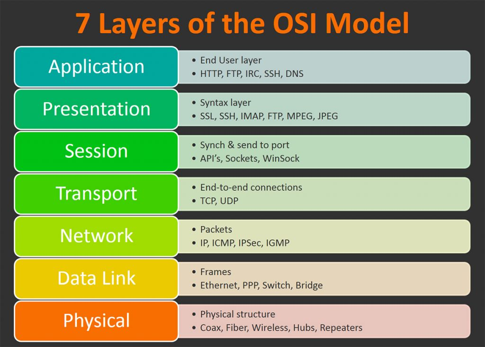
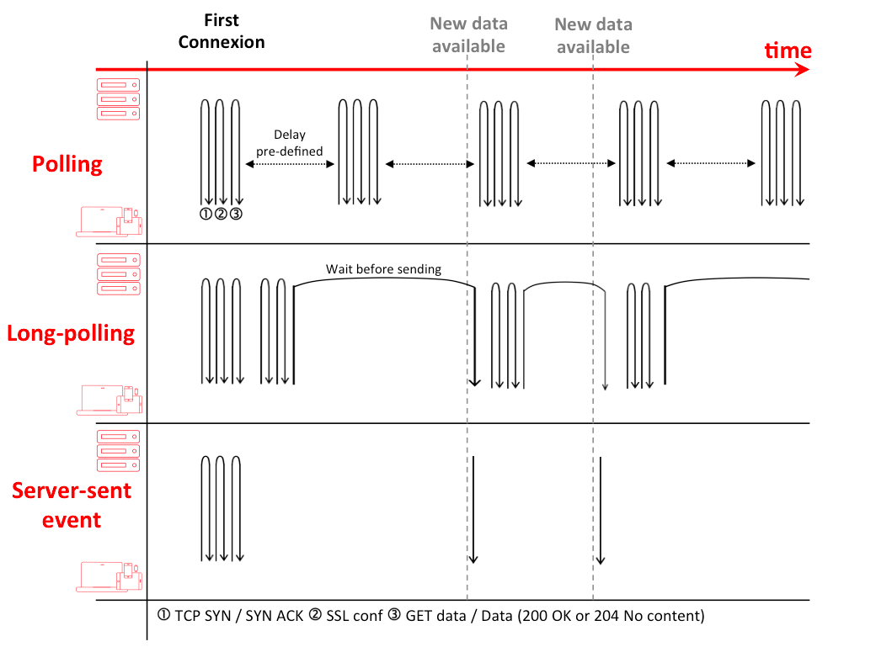

layout: true

.signature[@algogrit]

---

class: center, middle

# Websockets Training

Gaurav Agarwal

---

# Agenda

- *WebSockets* are magic!

---

class: center, middle


Software Engineer & Product Developer

Director of Engineering & Founder @ https://codermana.com

ex-Tarka Labs, ex-BrowserStack, ex-ThoughtWorks

---

class: center, middle

*What we wanted*


---

class: center, middle

*What we got*


---

## As an instructor

- I promise to

  - make this class as interactive as possible

  - use as many resources as available to keep you engaged

  - ensure everyone's questions are addressed

---

## What I need from you

- Be vocal

  - Let me know if there any audio/video issues ASAP

  - Feel free to interrupt me and ask me questions

- Be punctual

- Give feedback

- Work on the exercises

- Be *on mute* unless you are speaking

---
class: center, middle

## Class progression


---
class: center, middle

### 📚 Content ` > ` 🕒 Time

---
class: center, middle

## Show of hands

*Yay's - in Chat*

---
class: center, middle

## Why Websockets?

---
class: center, middle

### OSI Model Recap

---
class: center, middle


---
class: center, middle



---
class: center, middle

#### TCP vs UDP, ...

---
class: center, middle

#### ... & HTTP

---
class: center, middle

### Taking a closer look at `TCP` / `HTTP 1.*`

---
class: center, middle

TCP slow start

---
class: center, middle


---

When transmission of data from sender to receiver begins in a network, there may be unknown conditions as to what the network can handle. Slow start helps to mitigate the pitfalls of this unknown by implementing the following functionality.

- A sender begins transmissions to a receiver by slowly probing the network with a packet that contains its initial congestion window (cwnd).

- The client receives the packet and replies with its maximum buffer size, also known as the receiver's advertised window (rwnd).

- If the sender receives an acknowledgement from the client, it then doubles the amount of packets to send to the client.
Step 3 is repeated until the sender no longer receives acknowledgment from the receiver which means either congestion is detected, or the client's window limit has been reached.

.content-credits[https://www.keycdn.com/support/tcp-slow-start]

---
class: center, middle

### Problem with using a new HTTP req/resp for each BiDi message?

---

- The server is forced to use a number of different underlying TCP connections for each client: one for sending information to the client and a new one for each incoming message.

- The wire protocol has a high overhead, with each client-to-server message having an HTTP header.

- The client-side script is forced to maintain a mapping from the outgoing connections to the incoming connection to track replies.

---
class: center, middle

### Solution?

---
class: center, middle

2 way communication using *WebSocket*

---
class: center, middle


.image-credits[https://blogs.windows.com/windowsdeveloper/2016/03/14/when-to-use-a-http-call-instead-of-a-websocket-or-http-2-0/]

---
class: center, middle

### Alternatives?

---

- Polling

- Long Polling

- Server Side Events (SSE)

---
class: center, middle



.image-credits[https://codeburst.io/polling-vs-sse-vs-websocket-how-to-choose-the-right-one-1859e4e13bd9]

---
class: center, middle

## Websocket vs

---
class: center, middle

### ReST

---

#### *Re*presentational *S*tate *T*ransfer

- defined in 2000 by Roy Fielding in his doctoral dissertation

- it is designed for Internet-scale usage, so the coupling between the user agent (client) and the origin server must be as lightweight (loose) as possible

- Maps HTTP 1.1 methods onto CRUD actions

---

#### Architectural properties

- performance in component interactions, which can be the dominant factor in user-perceived performance and network efficiency

- scalability allowing the support of large numbers of components and interactions among components

- simplicity of a uniform interface

- modifiability of components to meet changing needs (even while the application is running)

- visibility of communication between components by service agents

- portability of components by moving program code with the data

- reliability in the resistance to failure at the system level in the presence of failures within components, connectors, or data

---
class: center, middle

Stateful vs *Stateless*

---
class: center, middle

### HTTP 2

---
class: center, middle

The biggest difference is that, unlike websockets, HTTP/2 defines its own multiplexing semantics: how streams get identifiers and how frames carry the id of the stream they're on. HTTP/2 also defines flow control semantics for prioritizing streams. This is important in most real-world applications of BiDi.

.content-credits[https://stackoverflow.com/questions/28582935/does-http-2-make-websockets-obsolete]

---
class: center, middle

## Enter the *Drogon*

---
class: center, middle

*Drogon* is a C++14/17-based HTTP application framework.

.content-credits[https://drogon.docsforge.com/]

---
class: center, middle

*Drogon* can be used to easily build various types of web application server programs using C++.

---
class: center, middle

cross-platform framework

---
class: center, middle

supports Linux, macOS, FreeBSD, OpenBSD, HaikuOS, and Windows

---

- Use a non-blocking I/O network lib based on *epoll* (*kqueue* under macOS/FreeBSD) to provide high-concurrency, high-performance network IO

- Support Http1.0/1.1 (server side and client side)

- Support cookies and built-in sessions

- Support back-end rendering, the controller generates the data to the view to generate the Html page. Views are described by CSP template files

- Provide a convenient and flexible routing solution from the path to the controller handler

---

- Support filter chains to facilitate the execution of unified logic

- Support https (based on OpenSSL)

- Support **WebSocket** (server side and client side)

- Support JSON format request and response, very friendly to the Restful API application development

- Support C++ coroutines

---
class: center, middle

and [more](https://drogon.docsforge.com/#overview)...

---
class: center, middle

### [Setting up `Drogon`](https://github.com/AgarwalConsulting/websockets-training/blob/master/Setup.md)

.content-credits[https://drogon.docsforge.com/master/installation/]

---
class: center, middle

### Rapid Application Development with `drogon_ctl`

---
class: center, middle

**Demo**: Building a simple server with Drogon

---
class: center, middle

#### Creating a new project

```bash
drogon_ctl create project <project-name>
```

---
class: center, middle

Understanding the project structure & `main.cc`

---
class: center, middle

#### Adding a simple `index.html`

```bash
echo '<h1>Hello Drogon!</h1>' >> index.html
```

---
class: center, middle

#### Building and running the application

```bash
cd build
cmake ..
make

./<binary>
```

---

### Type of Controllers

- Simple Controller

- HTTP Controller

- Websocket Controller

---
class: center, middle

*Demo*: Building a simple "Hello, World!" API

---
class: center, middle

#### Creating a Simple HTTP Controller

```bash
drogon_ctl create controller <YourController>
```

---
class: center, middle

#### How about a ReSTful API?

---
class: center, middle

*Code Walkthrough*: An employee management server

---
class: center, middle

## C++ 14/17 Refresher (Optional)

---

- RAII

- std::move

- Smart Pointers

- Functional Programming

  - Lambdas

  - Closures

- Concurrency using Coroutines

---
class: center, middle

## Understanding WebSockets

---
class: center, middle

### [RFC 6455](https://datatracker.ietf.org/doc/html/rfc6455)

.content-credits[https://datatracker.ietf.org/doc/html/rfc6455]

---
class: center, middle

*The WebSocket Protocol enables two-way communication between a client running untrusted code in a controlled environment to a remote host that has opted-in to communications from that code.*

---
class: center, middle

*The protocol consists of an opening handshake followed by basic message framing, layered over TCP.*

---

The handshake from the client looks as follows:

```
  GET /chat HTTP/1.1
  Host: server.example.com
  Upgrade: websocket
  Connection: Upgrade
  Sec-WebSocket-Key: dGhlIHNhbXBsZSBub25jZQ==
  Origin: http://example.com
  Sec-WebSocket-Protocol: chat, superchat
  Sec-WebSocket-Version: 13
```

The handshake from the server looks as follows:

```
  HTTP/1.1 101 Switching Protocols
  Upgrade: websocket
  Connection: Upgrade
  Sec-WebSocket-Accept: s3pPLMBiTxaQ9kYGzzhZRbK+xOo=
  Sec-WebSocket-Protocol: chat
```

---
class: center, middle

*Once the client and server have both sent their handshakes, and if the handshake was successful, then the data transfer part starts.*

---
class: center, middle

*clients and servers transfer data back and forth in conceptual units referred to in this specification as "messages"*

---

class: center, middle

Code
https://github.com/AgarwalConsulting/websockets-training

Slides
https://websockets-training.slides.agarwalconsulting.io
